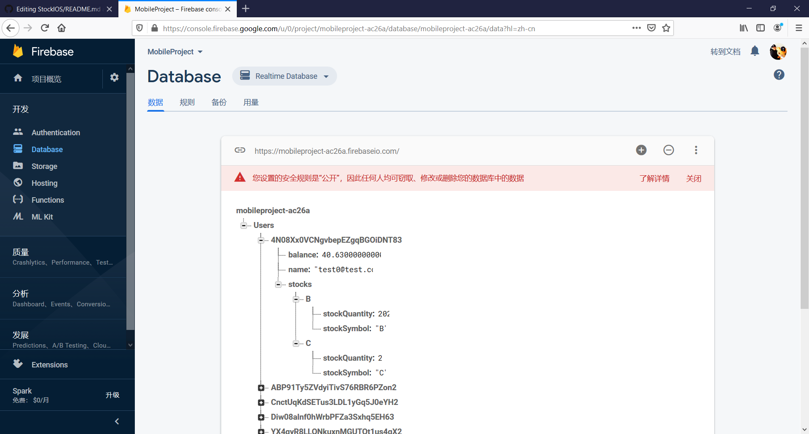

# StockIOS
Mobile Project

The mobile is build based on Swift.

Function: Login/Logout, Buy/Sell stock, Get stock information from API, Portfolio

Database: Firebase

.png)
Once user registed, user account deatails appeared here, uid will be the primary key for the user's database

For an individual user, the table name(PK) for the user's database is his uId in Authentication database. There are username, balance and another array called Stocks to store their stock quantity and stock symbol.

This is not meant to be a public Repo initially, masters' branch is Alex Chen's branch, all the work orginially committed by Alexzqc on masters' branch is done by Alex Chen. Sorry for the confusing.
